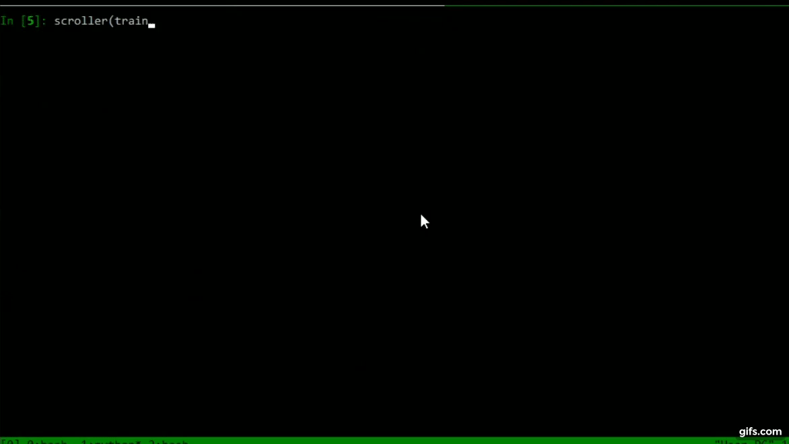

datascroller - data scrolling in the terminal!
==============================================================================

Welcome to the datascroller project! While IDEs and notebooks are excellent
or interactive data exploration, there will always be some of us who prefer
to stay in the terminal. For exploring Pandas data frames, that meant
painstakingly tedius use of .iloc, until now...



## Usage
### Keys
The default (only at the moment) keys are set up to resemble Vim's edit mode.

The following keys are currently supported:
#### Movement
  - h: move to the left
  - j: move down
  - k: move up
  - l: move left 
#### Data Frame Resizing
  - d: grow data frame by one column
  - x: grow data frame by one row
  - a: shrink data frame by one column
  - w: shring data frame by one row
#### Quick Movement
  - Ctrl + F: Page down
  - Ctrl + B: Page up (not working as well for some reason)

### Code
Using iPython is a good way to try out datascroller interactively:
```
import pandas as pd
from datascroller.scroller import scroller

train = pd.read_csv(
    'https://raw.githubusercontent.com/datasets/house-prices-uk/master/data/data.csv')

scroller(train)
```

## Installation
### Via pip
```
pip install datascroller
```
