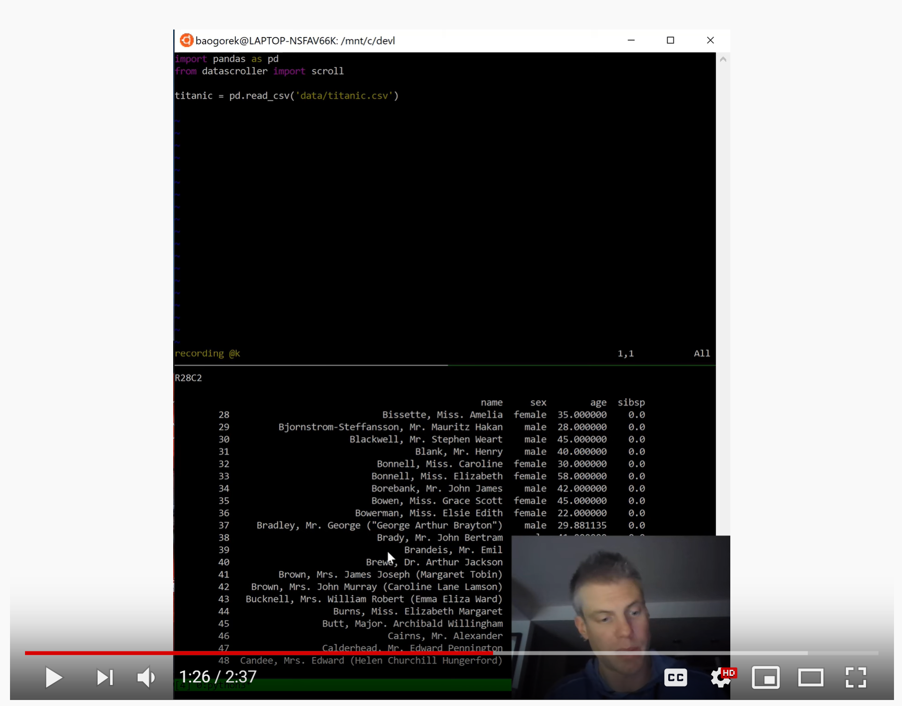
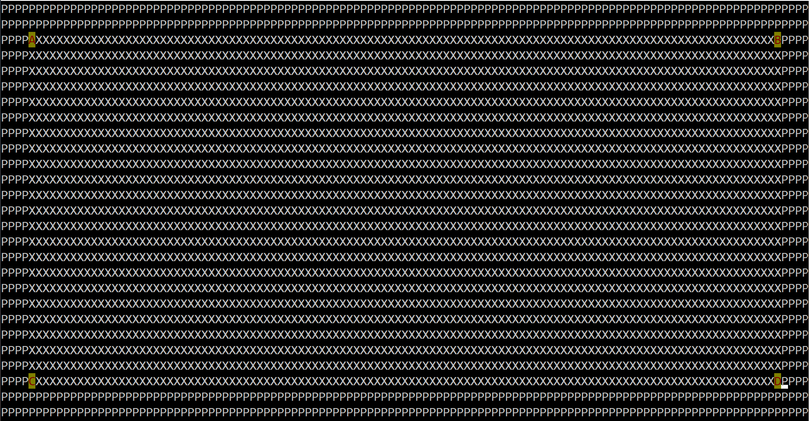

datascroller - data scrolling in the terminal!
==============================================================================

Welcome to the datascroller project! While IDEs and notebooks are excellent
for interactive data exploration, there will always be some of us who prefer
to stay in the terminal. For exploring Pandas data frames, that meant
painstakingly tedius use of `.iloc`, until now...

See datascroller in action on [YouTube](http://www.youtube.com/watch?v=mewJAcurJPg):

[](http://www.youtube.com/watch?v=mewJAcurJPg "datascroller")

## Installation
### via pip
```
pip install datascroller
```

## Usage

### A quick demo
In a command line environment where datascroller is installed, run
`scroll_demo` and refer to the "Keys" Section below. Press "q" to quit.

### The CSV scroller binary
In a command line environment where datascroller is installed, run
`scroll <path to your csv>` and refer to the "Keys" Section for navigation.
Press "q" to quit.

### Within Python or iPython
Import the `scroll` function from the `datascroller` module.
Call `scroll` with a Pandas DataFrame as the sole argument:

```
import pandas as pd
from datascroller import scroll

my_df = pd.read_csv('<path to your csv>')
scroll(my_df)
```

See the "Keys" section below for navidation. Press 'q' to quit viewing.

### Keys
Until configuration options are provided in a later version, the keys are set
up to resemble Vim's edit mode.

The following keys are currently supported:

- Movement
  + h: move to the left
  + j: move down
  + k: move up
  + l: move left 

- Quick Movement
  + Ctrl + F: Page down
  + Ctrl + B: Page up (not working as well for some reason)

- Exiting
  + q

### Examples

Using iPython is a good way to try out datascroller interactively:
```
import pandas as pd
from datascroller import scroll

train = pd.read_csv(
    'https://raw.githubusercontent.com/datasets/house-prices-uk/master/data/data.csv')

scroll(train)
```

## Classes within datascroller

Making datascroller work in arbitrarily sized terminal windows is challenging.
The ViewingArea and DFWindow classes help with keeping track of state and
separating concepts.

### ViewingArea

The ViewingArea class represents the character matrix available to curses. The
following example instantiates a ViewingArea object with character paddings
of 4 and 2 in the horizonal and vertical orientations, respectively:

```
from datascroller.scroller import ViewingArea
va = ViewingArea(4, 2)
va.show_curses_representation()
```

The `show_curses_representation()` method provides a brief visual display of
the character matrix and the bounds of display for the data window.


### DFWindow

The DFWindow class is responsible for maintaining a subset of the original data
frame, made clear by its flagship method:
```
def get_dataframe_window(self):
    """DataFrame window of form self.df[r_1:r_2, c_1:c_2]"""
    return self.full_df.iloc[self.r_1:self.r_2, self.c_1:self.c_2]
```
DFWindow must be aware of the viewing area in order to set an appropriate value
of `self.c_2`, and hence DFWindow requires an instance of ViewingArea for
initialization. 
```
import pandas as pd
from datascroller.scroller import DFWindow
from datascroller.scroller import ViewingArea

my_df = pd.read_csv(
    'https://raw.githubusercontent.com/datasets/house-prices-uk/master/data/data.csv')

va = ViewingArea(4, 2)
df_window = DFWindow(my_df, va)
df_window.find_last_fitting_column()

print(df_window.c_1)
print(df_window.c_2)

df_window.move_right()

print(df_window.c_1)
print(df_window.c_2)

print(df_window.get_dataframe_window())

import curses
stdscr = curses.initscr()
df_window.add_data_to_screen(stdscr)
stdscr.refresh()
curses.endwin()
```
